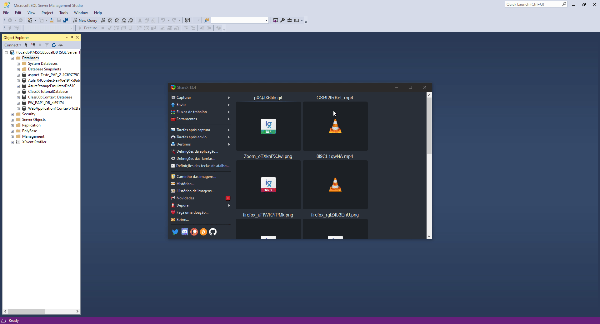
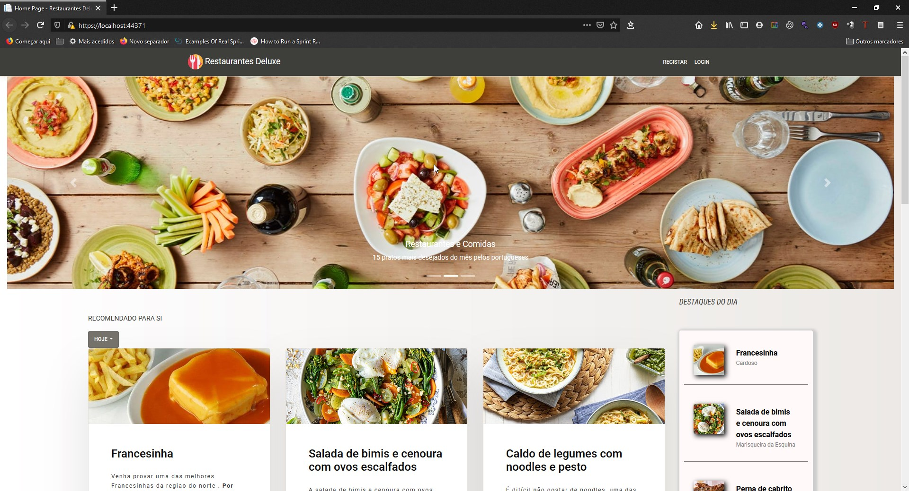

# Prato_do_Dia

**Como inserir base de dados já populada:**

Faça o download do ficheiro .bak no diretório "Backup de base de dados"

Tutorial de como efetuar o restore da cópia de base de dados:

(De relembrar que é crucial antes de fazer o restore de se certificar que não possui outra base de dados com o nome "Restaurantes")
De preferência efetua esse restore da base de dados no localdb. (dessa forma não tem que alterar o appsettings da aplicação)

Passwords das contas de utilizadores são usualmente : "abc123", caso não funcione use "restaurante"

**Print da aplicação em funcionamento com a base de dados aplicada:**

